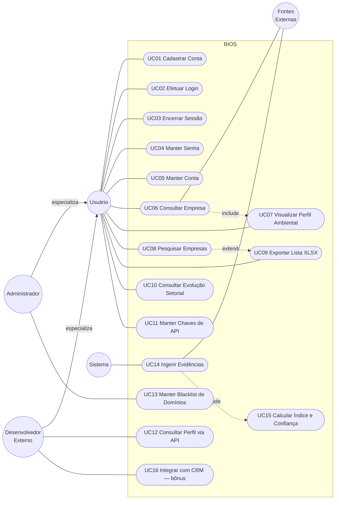
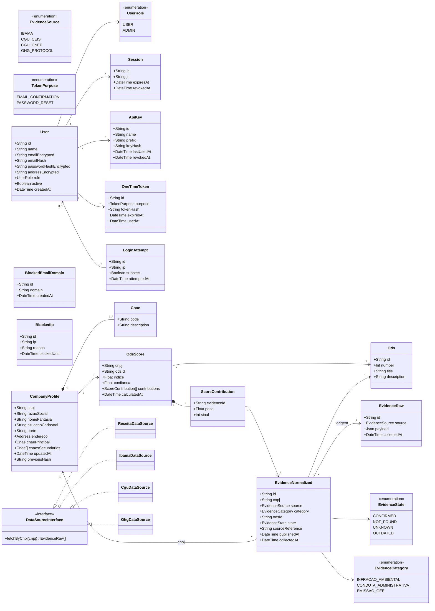
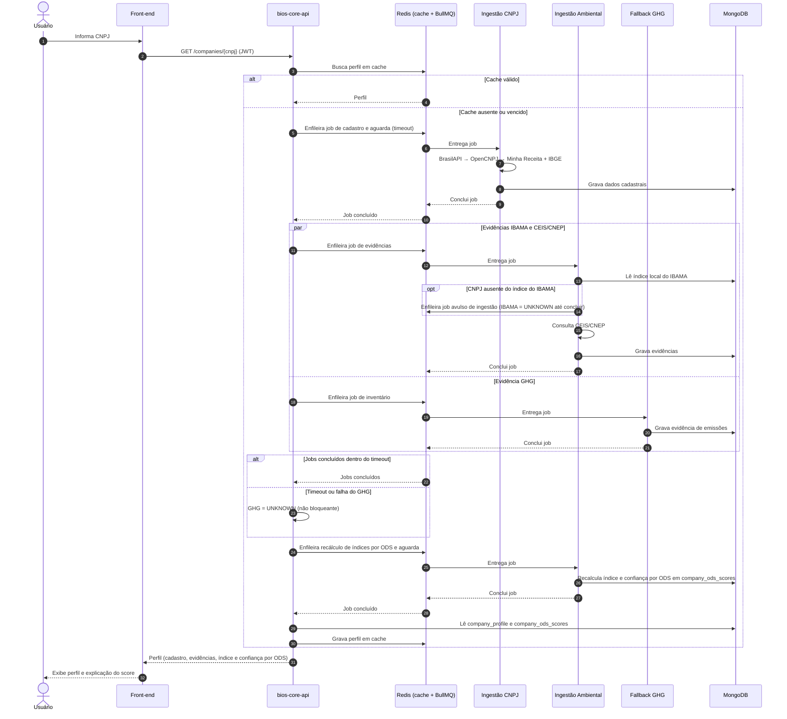
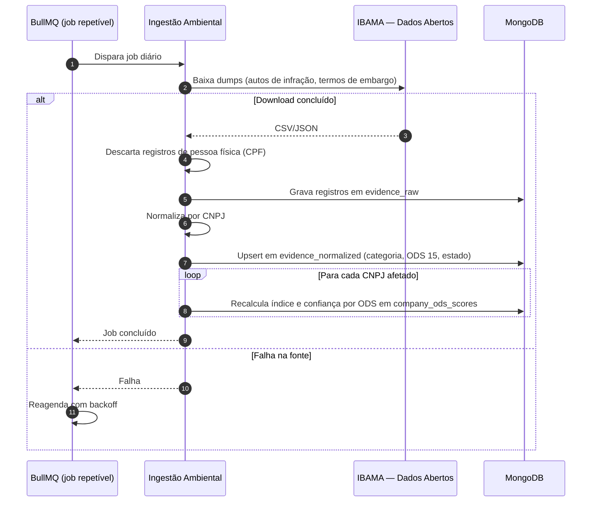
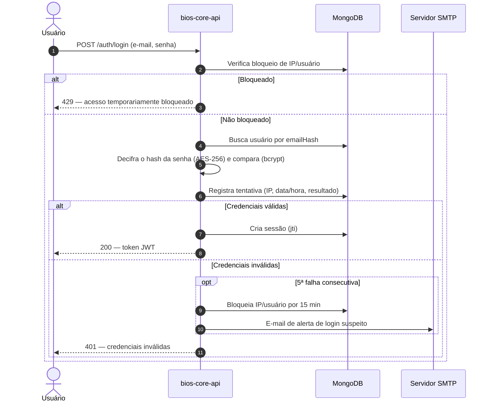
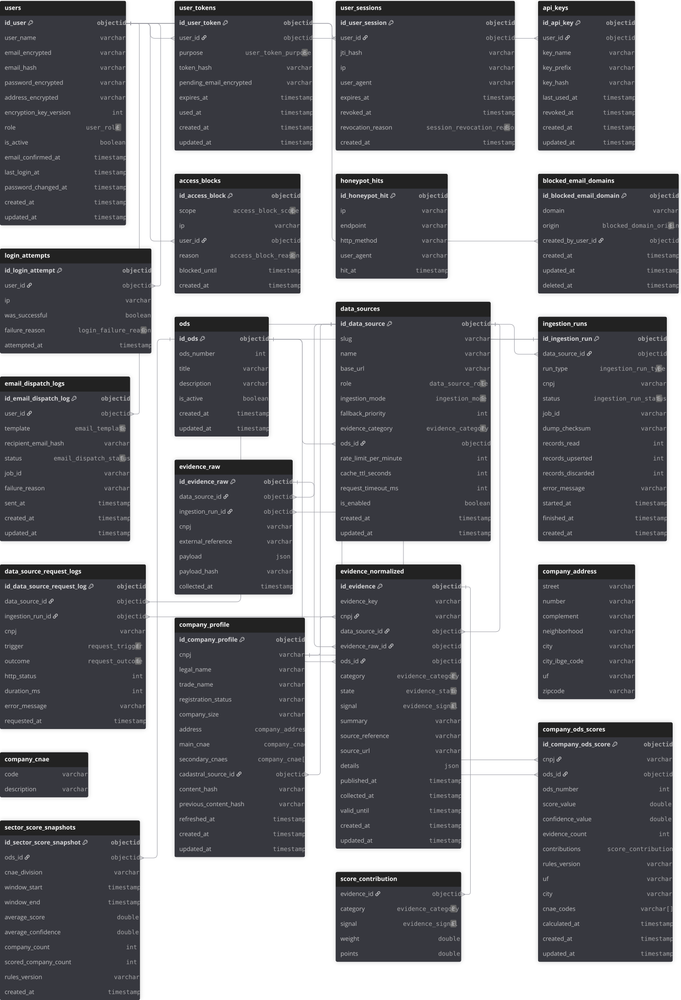
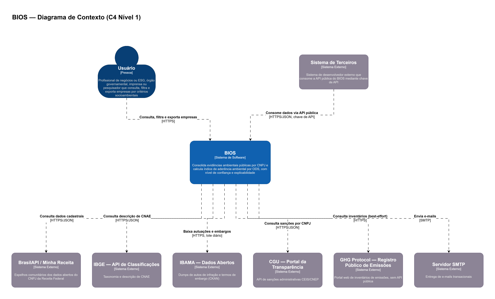
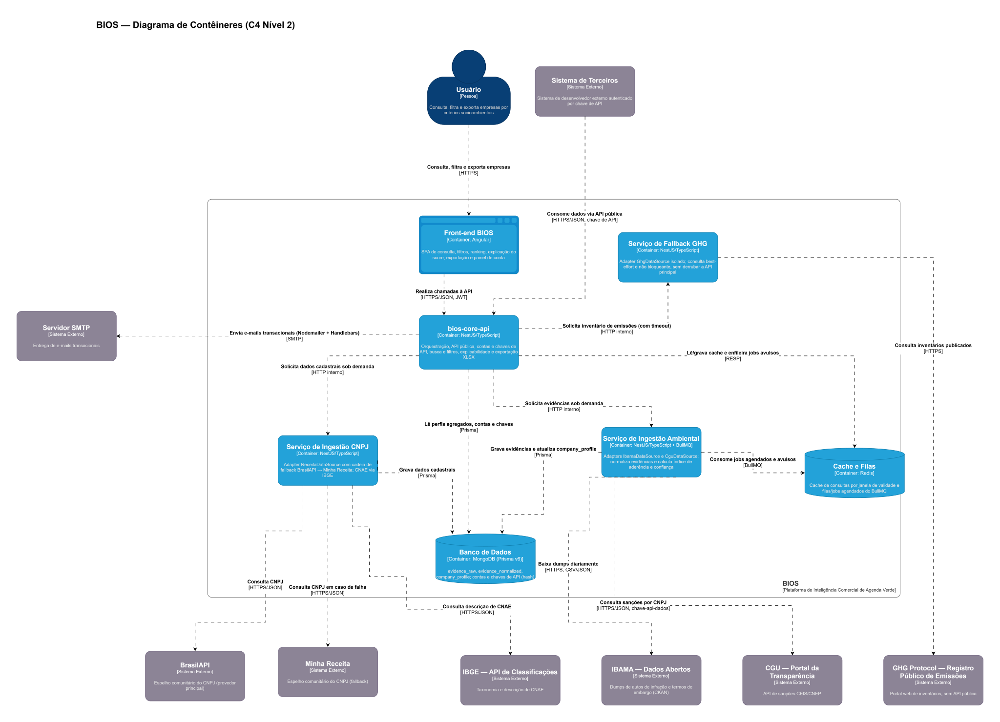

# 08. Artefatos de Análise

Esta seção apresenta os artefatos gerados pela Análise: casos de uso (diagrama e descrição),
diagrama de classes de domínio, diagramas de sequência dos fluxos principais, modelo de dados
e diagramas de arquitetura no modelo C4. Os diagramas 1 a 6 estão escritos em Mermaid,
renderizado nativamente pelo GitHub e versionado como texto junto à documentação; os
diagramas C4 (7 e 8) têm sua fonte editável em `assets/diagrams/bios-c4-architecture.drawio`.

Os atores referenciados são os definidos no Quadro 2 (`04-Atores-e-Histórias-dos-Usuários.md`).

## 8.1 Diagrama de Casos de Uso

O diagrama 1 representa os casos de uso do sistema BIOS. O Administrador é uma especialização
do Usuário (mesma entidade, com papel `ADMIN`) e herda todos os seus casos de uso; o
Desenvolvedor Externo é um Usuário atuando via API.

<b>Diagrama 1 - Casos de Uso</b>

O honeypot ([RF21]) e o bloqueio de IP não aparecem como casos de uso porque não atendem a
nenhum ator legítimo: são mecanismos de defesa, descritos em `06-Requisitos-Nao-Funcionais.md`
([NFSE07]) e no fluxo alternativo do UC02.

## 8.2 Descrição dos Casos de Uso

Esta seção descreve todos os casos de uso do diagrama 1.

<table>
    <tr>
        <td><b>Nome:</b> UC01 — Cadastrar Conta.</td>
        <td colspan="2"><b>Objetivo/Descrição:</b> Permitir que uma pessoa crie uma conta e a ative por confirmação de e-mail. ([RF01], [RF22], [RF28], [RF18])</td>
    </tr>
    <tr>
        <td><b>Ator(es):</b> Usuário.</td>
        <td><b>Ator(es) Secundário(s):</b> Sistema.</td>
    </tr>
    <tr>
        <td colspan="2"><b>Pré-condições:</b> A pessoa não deve possuir conta ativa com o mesmo e-mail.</td>
    </tr>
	<tr>
        <td colspan="2"><b>Fluxo Normal:</b>
		 1 - O usuário acessa a tela de cadastro e informa nome, e-mail e senha. 
		 2 - O sistema valida os dados e verifica se o domínio do e-mail consta na blacklist. 
		 3 - O sistema cria a conta com estado inativo e papel <code>USER</code>, criptografando os dados sensíveis. 
		 4 - O sistema envia e-mail transacional com link de confirmação. 
		 5 - O usuário acessa o link de confirmação. 
		 6 - O sistema valida o token e ativa a conta. 
		 7 - Este caso de uso finaliza aqui. </td></tr>
	<tr>
        <td colspan="2"><b>Fluxos Alternativos:</b>
		 2.1 - O domínio do e-mail consta na blacklist: o sistema recusa o cadastro com mensagem genérica e volta a 1. 
		 2.2 - O e-mail já está cadastrado: o sistema exibe a mesma mensagem genérica de sucesso, sem revelar a existência da conta, e não envia novo e-mail de confirmação. 
		 6.1 - O token está expirado ou já foi usado: o sistema exibe erro e oferece o reenvio do link. </td></tr>
	<tr>
        <td colspan="2"><b>Pós-condições:</b> Conta ativa, apta a efetuar login (UC02).</td></tr>
	<tr>
        <td colspan="2"><b>Regras de Negócio:</b>
		 1 - Contas não confirmadas não podem efetuar login. 
		 2 - O token de confirmação é de uso único e tem validade limitada. 
		 3 - E-mail e endereço são armazenados com AES-256; a senha recebe duas camadas — hash bcrypt, cifrado em seguida com AES-256 ([NFSE03]). </td></tr>
</table>

  

<table>
    <tr>
        <td><b>Nome:</b> UC02 — Efetuar Login.</td>
        <td colspan="2"><b>Objetivo/Descrição:</b> Permitir autenticação e identificação de usuários. ([RF02], [RF19], [RF20], [RF18])</td>
    </tr>
    <tr>
        <td><b>Ator(es):</b> Usuário.</td>
        <td><b>Ator(es) Secundário(s):</b> Sistema.</td>
    </tr>
    <tr>
        <td colspan="2"><b>Pré-condições:</b> O usuário deve possuir conta ativa (UC01).</td>
    </tr>
	<tr>
        <td colspan="2"><b>Fluxo Normal:</b>
		 1 - O usuário acessa a tela de login e informa e-mail e senha. 
		 2 - O sistema verifica se o IP e o usuário não estão bloqueados. 
		 3 - O sistema valida as credenciais e registra a tentativa (IP, data/hora, resultado). 
		 4 - O sistema emite um token JWT de sessão revogável. 
		 5 - Exibe a tela principal do sistema de acordo com o papel. 
		 6 - Este caso de uso finaliza aqui. </td></tr>
	<tr>
        <td colspan="2"><b>Fluxos Alternativos:</b>
		 2.1 - IP ou usuário bloqueado: o sistema recusa a tentativa, informa que o acesso está temporariamente bloqueado e encerra o caso de uso. 
		 3.1 - Credenciais inválidas: o sistema registra a falha e exibe mensagem genérica de credenciais inválidas. 
		 3.2 - Quinta falha consecutiva: o sistema bloqueia IP e/ou usuário por 15 minutos e envia e-mail de alerta de login suspeito ao titular da conta. 
		 3.3 - Volta a 1. </td></tr>
	<tr>
        <td colspan="2"><b>Pós-condições:</b> Sessão ativa de acordo com o papel do usuário.</td></tr>
	<tr>
        <td colspan="2"><b>Regras de Negócio:</b>
		 1 - Somente contas ativas podem se autenticar. 
		 2 - 5 tentativas consecutivas malsucedidas resultam em bloqueio de 15 minutos ([NFSE06]). 
		 3 - A mensagem de erro não distingue e-mail inexistente de senha incorreta. </td></tr>
</table>

  

<table>
    <tr>
        <td><b>Nome:</b> UC03 — Encerrar Sessão.</td>
        <td colspan="2"><b>Objetivo/Descrição:</b> Permitir que o usuário encerre sua sessão a qualquer momento. ([RF23])</td>
    </tr>
    <tr>
        <td><b>Ator(es):</b> Usuário.</td>
        <td><b>Ator(es) Secundário(s):</b> Não há.</td>
    </tr>
    <tr>
        <td colspan="2"><b>Pré-condições:</b> O usuário deve estar com sessão ativa.</td>
    </tr>
	<tr>
        <td colspan="2"><b>Fluxo Normal:</b>
		 1 - O usuário seleciona a opção sair. 
		 2 - O sistema revoga o token JWT ativo. 
		 3 - Exibe a tela de login. 
		 4 - Este caso de uso finaliza aqui. </td></tr>
	<tr>
        <td colspan="2"><b>Fluxos Alternativos:</b> Não há.</td></tr>
	<tr>
        <td colspan="2"><b>Pós-condições:</b> O token revogado não é mais aceito em nenhuma requisição.</td></tr>
	<tr>
        <td colspan="2"><b>Regras de Negócio:</b> Sessões revogadas são verificadas a cada requisição autenticada ([NFSE05]).</td></tr>
</table>

  

<table>
    <tr>
        <td><b>Nome:</b> UC04 — Manter Senha.</td>
        <td colspan="2"><b>Objetivo/Descrição:</b> Permitir alterar a senha (autenticado) ou recuperá-la quando esquecida (não autenticado). ([RF24], [RF25], [RF18])</td>
    </tr>
    <tr>
        <td><b>Ator(es):</b> Usuário.</td>
        <td><b>Ator(es) Secundário(s):</b> Sistema.</td>
    </tr>
    <tr>
        <td colspan="2"><b>Pré-condições:</b> O usuário deve possuir conta ativa.</td>
    </tr>
	<tr>
        <td colspan="2"><b>Fluxo Normal (alteração):</b>
		 1 - O usuário autenticado acessa a opção alterar senha. 
		 2 - Informa a senha atual e a nova senha. 
		 3 - O sistema valida a senha atual e grava a nova. 
		 4 - O sistema revoga todas as sessões ativas do usuário. 
		 5 - Exibe a tela de login. 
		 6 - Este caso de uso finaliza aqui. </td></tr>
	<tr>
        <td colspan="2"><b>Fluxos Alternativos:</b>
		 1.1 - Recuperação: o usuário não autenticado informa o e-mail na tela de recuperação. 
		 1.2 - O sistema envia, se o e-mail existir, um link com token de uso único e validade limitada, exibindo sempre a mesma mensagem de confirmação. 
		 1.3 - O usuário acessa o link e informa a nova senha; o sistema valida o token, grava a senha e revoga as sessões ativas. Vai para 5. 
		 3.1 - Senha atual incorreta: o sistema exibe erro e volta a 2. </td></tr>
	<tr>
        <td colspan="2"><b>Pós-condições:</b> Nova senha em vigor e nenhuma sessão anterior ativa.</td></tr>
	<tr>
        <td colspan="2"><b>Regras de Negócio:</b>
		 1 - O token de recuperação é de uso único e tem validade limitada. 
		 2 - A tela de recuperação não revela se o e-mail informado está cadastrado. </td></tr>
</table>

  

<table>
    <tr>
        <td><b>Nome:</b> UC05 — Manter Conta.</td>
        <td colspan="2"><b>Objetivo/Descrição:</b> Permitir que o usuário edite seus dados de conta ou exclua a própria conta. ([RF26], [RF27], [RF28])</td>
    </tr>
    <tr>
        <td><b>Ator(es):</b> Usuário.</td>
        <td><b>Ator(es) Secundário(s):</b> Sistema.</td>
    </tr>
    <tr>
        <td colspan="2"><b>Pré-condições:</b> O usuário deve estar com sessão ativa.</td>
    </tr>
	<tr>
        <td colspan="2"><b>Fluxo Normal (edição):</b>
		 1 - O usuário acessa o painel de conta e edita nome e/ou endereço. 
		 2 - O sistema valida e grava os dados criptografados. 
		 3 - Exibe sucesso. 
		 4 - Este caso de uso finaliza aqui. </td></tr>
	<tr>
        <td colspan="2"><b>Fluxos Alternativos:</b>
		 1.1 - Alteração de e-mail: o sistema envia confirmação ao novo endereço e só efetiva a troca após a confirmação ([RF28]). 
		 1.2 - Exclusão: o usuário seleciona excluir conta e confirma com a senha. 
		 1.3 - O sistema remove os dados pessoais, revoga todas as chaves de API e encerra todas as sessões. Exibe a tela inicial e finaliza o caso de uso. </td></tr>
	<tr>
        <td colspan="2"><b>Pós-condições:</b> Dados atualizados; ou, na exclusão, nenhum dado pessoal do titular mantido e nenhuma credencial (sessão ou chave) válida.</td></tr>
	<tr>
        <td colspan="2"><b>Regras de Negócio:</b>
		 1 - A exclusão atende ao direito de eliminação do titular previsto na LGPD ([NFSE02]). 
		 2 - Registros de tentativa de login associados à conta excluída mantêm apenas IP e data/hora, desvinculados do titular. </td></tr>
</table>

  

<table>
    <tr>
        <td><b>Nome:</b> UC06 — Consultar Empresa.</td>
        <td colspan="2"><b>Objetivo/Descrição:</b> Permitir localizar uma empresa por CNPJ ou por razão social/nome fantasia e exibir seus dados cadastrais. ([RF03], [RF04], [RF05], [RF06])</td>
    </tr>
    <tr>
        <td><b>Ator(es):</b> Usuário.</td>
        <td><b>Ator(es) Secundário(s):</b> Fontes Externas (Receita Federal via BrasilAPI/OpenCNPJ/Minha Receita, IBGE).</td>
    </tr>
    <tr>
        <td colspan="2"><b>Pré-condições:</b> O usuário deve estar com sessão ativa.</td>
    </tr>
	<tr>
        <td colspan="2"><b>Fluxo Normal:</b>
		 1 - O usuário informa um CNPJ no campo de busca. 
		 2 - O sistema valida o formato e os dígitos verificadores do CNPJ. 
		 3 - O sistema busca o perfil em cache; se ausente ou vencido, consulta a BrasilAPI. 
		 4 - O sistema exibe razão social, situação cadastral, porte, endereço e CNAE principal e secundários com descrição. 
		 5 - Inclui UC07 (Visualizar Perfil Ambiental). 
		 6 - Este caso de uso finaliza aqui. </td></tr>
	<tr>
        <td colspan="2"><b>Fluxos Alternativos:</b>
		 1.1 - Busca por nome: o usuário informa razão social ou nome fantasia; o sistema lista as empresas da base local por aproximação; o usuário seleciona uma e vai para 4. 
		 2.1 - CNPJ inválido: o sistema exibe erro de validação e volta a 1. 
		 3.1 - BrasilAPI indisponível ou sem retorno: o sistema consulta o OpenCNPJ; persistindo a falha, consulta a Minha Receita (fallback final). 
		 3.2 - Os três provedores indisponíveis e sem cache: o sistema informa indisponibilidade temporária dos dados cadastrais. 
		 3.3 - CNPJ inexistente: o sistema informa que a empresa não foi encontrada. </td></tr>
	<tr>
        <td colspan="2"><b>Pós-condições:</b> Perfil cadastral da empresa exibido e armazenado em cache.</td></tr>
	<tr>
        <td colspan="2"><b>Regras de Negócio:</b>
		 1 - Nenhum dado pessoal de sócios ou administradores é exibido ou armazenado ([INL02]). 
		 2 - A busca por nome opera apenas sobre empresas já presentes na base local, pois nenhuma das fontes cadastrais oferece busca por nome. 
		 3 - Consultas em cache devem responder em até 2 segundos ([NFDE02]). </td></tr>
</table>

  

<table>
    <tr>
        <td><b>Nome:</b> UC07 — Visualizar Perfil Ambiental.</td>
        <td colspan="2"><b>Objetivo/Descrição:</b> Exibir as evidências da empresa e, para cada ODS (13 e 15), o índice de aderência, o nível de confiança e a explicação do score. ([RF07], [RF08], [RF09], [RF10], [RF11], [RF12])</td>
    </tr>
    <tr>
        <td><b>Ator(es):</b> Usuário.</td>
        <td><b>Ator(es) Secundário(s):</b> Fontes Externas (CGU, GHG Protocol).</td>
    </tr>
    <tr>
        <td colspan="2"><b>Pré-condições:</b> Empresa localizada via UC06.</td>
    </tr>
	<tr>
        <td colspan="2"><b>Fluxo Normal:</b>
		 1 - O sistema recupera as evidências da empresa: IBAMA a partir do índice local do lote diário; CEIS/CNEP e GHG Protocol a partir de cache ou consulta sob demanda. 
		 2 - O sistema exibe as evidências agrupadas por categoria, com fonte, estado, data de publicação, data de coleta e link da fonte original. 
		 3 - O sistema exibe, para cada ODS, o índice de aderência e o nível de confiança, lado a lado e nunca combinados. 
		 4 - O usuário seleciona a explicação do score de um ODS. 
		 5 - O sistema lista as evidências que compuseram o índice, com peso e sinal (positivo/negativo). 
		 6 - Este caso de uso finaliza aqui. </td></tr>
	<tr>
        <td colspan="2"><b>Fluxos Alternativos:</b>
		 1.1 - CNPJ ausente do índice local do IBAMA: o sistema enfileira um job avulso de ingestão para o CNPJ (UC14) e exibe a evidência do IBAMA como <code>UNKNOWN</code> até a conclusão do job. 
		 1.2 - CGU ou GHG Protocol indisponível (ou timeout do serviço de fallback GHG): o sistema exibe as evidências das demais fontes e marca a fonte afetada como <code>UNKNOWN</code> ([NFCO01]). </td></tr>
	<tr>
        <td colspan="2"><b>Pós-condições:</b> Perfil ambiental exibido com rastreabilidade até a fonte de cada evidência.</td></tr>
	<tr>
        <td colspan="2"><b>Regras de Negócio:</b>
		 1 - O sistema nunca afirma que a empresa "é" ou "não é" sustentável ([IND01]). 
		 2 - <code>UNKNOWN</code> nunca é apresentado nem pontuado como evidência negativa ([IND02]). 
		 3 - Sanções do CEIS/CNEP são exibidas como conduta administrativa, nunca como infração ambiental. 
		 4 - Os índices dos ODS 13 e 15 não são comparáveis entre si e não são combinados em índice geral. </td></tr>
</table>

  

<table>
    <tr>
        <td><b>Nome:</b> UC08 — Pesquisar Empresas.</td>
        <td colspan="2"><b>Objetivo/Descrição:</b> Permitir filtrar e ordenar empresas da base por critérios cadastrais e socioambientais. ([RF13], [RF14])</td>
    </tr>
    <tr>
        <td><b>Ator(es):</b> Usuário.</td>
        <td><b>Ator(es) Secundário(s):</b> Não há.</td>
    </tr>
    <tr>
        <td colspan="2"><b>Pré-condições:</b> O usuário deve estar com sessão ativa.</td>
    </tr>
	<tr>
        <td colspan="2"><b>Fluxo Normal:</b>
		 1 - O usuário acessa a tela de pesquisa. 
		 2 - Informa filtros de CNAE, UF e/ou município. 
		 3 - Seleciona um ODS e, opcionalmente, índice mínimo e confiança mínima para esse ODS. 
		 4 - Escolhe a ordenação pelo índice do ODS selecionado (ascendente ou descendente). 
		 5 - O sistema exibe a lista paginada de empresas. 
		 6 - Este caso de uso finaliza aqui. </td></tr>
	<tr>
        <td colspan="2"><b>Fluxos Alternativos:</b>
		 5.1 - Nenhum resultado: o sistema informa que nenhuma empresa atende aos filtros. 
		 5.2 - O usuário seleciona exportar: estende para UC09. </td></tr>
	<tr>
        <td colspan="2"><b>Pós-condições:</b> Lista filtrada exibida.</td></tr>
	<tr>
        <td colspan="2"><b>Regras de Negócio:</b>
		 1 - A pesquisa opera apenas sobre empresas já presentes em <code>company_profile</code>. 
		 2 - Filtros de índice, confiança e ordenação sempre se referem a um único ODS selecionado. </td></tr>
</table>

  

<table>
    <tr>
        <td><b>Nome:</b> UC09 — Exportar Lista XLSX.</td>
        <td colspan="2"><b>Objetivo/Descrição:</b> Permitir exportar a lista resultante de uma pesquisa em formato XLSX. ([RF15])</td>
    </tr>
    <tr>
        <td><b>Ator(es):</b> Usuário.</td>
        <td><b>Ator(es) Secundário(s):</b> Não há.</td>
    </tr>
    <tr>
        <td colspan="2"><b>Pré-condições:</b> Pesquisa realizada via UC08 com ao menos um resultado.</td>
    </tr>
	<tr>
        <td colspan="2"><b>Fluxo Normal:</b>
		 1 - O usuário seleciona exportar na tela de resultados. 
		 2 - O sistema gera o arquivo com os mesmos filtros e ordenação aplicados. 
		 3 - O navegador inicia o download do arquivo. 
		 4 - Este caso de uso finaliza aqui. </td></tr>
	<tr>
        <td colspan="2"><b>Fluxos Alternativos:</b> Não há.</td></tr>
	<tr>
        <td colspan="2"><b>Pós-condições:</b> Arquivo XLSX entregue ao usuário.</td></tr>
	<tr>
        <td colspan="2"><b>Regras de Negócio:</b>
		 1 - O arquivo contém dados cadastrais da pessoa jurídica e, em colunas separadas por ODS, índice e nível de confiança. 
		 2 - O arquivo não contém nenhum dado pessoal ou de contato de indivíduo ([INL02]). </td></tr>
</table>

  

<table>
    <tr>
        <td><b>Nome:</b> UC10 — Consultar Evolução Setorial.</td>
        <td colspan="2"><b>Objetivo/Descrição:</b> Exibir a evolução do índice médio de cada ODS por setor (CNAE) ao longo do tempo. ([RF30]; prioridade Desejável)</td>
    </tr>
    <tr>
        <td><b>Ator(es):</b> Usuário.</td>
        <td><b>Ator(es) Secundário(s):</b> Não há.</td>
    </tr>
    <tr>
        <td colspan="2"><b>Pré-condições:</b> O usuário deve estar com sessão ativa; a série histórica de scores deve estar disponível (ver <code>15-Impacto-Ambiental.md</code>, seção 15.4).</td>
    </tr>
	<tr>
        <td colspan="2"><b>Fluxo Normal:</b>
		 1 - O usuário seleciona um CNAE e um ODS. 
		 2 - O sistema exibe o índice médio do setor por janela de tempo. 
		 3 - Este caso de uso finaliza aqui. </td></tr>
	<tr>
        <td colspan="2"><b>Fluxos Alternativos:</b>
		 2.1 - Histórico insuficiente: o sistema informa que ainda não há janelas suficientes para o setor. </td></tr>
	<tr>
        <td colspan="2"><b>Pós-condições:</b> Evolução setorial exibida.</td></tr>
	<tr>
        <td colspan="2"><b>Regras de Negócio:</b> A evolução é sempre agregada por setor, nunca exibida por empresa individual ([IA05]).</td></tr>
</table>

  

<table>
    <tr>
        <td><b>Nome:</b> UC11 — Manter Chaves de API.</td>
        <td colspan="2"><b>Objetivo/Descrição:</b> Permitir que o usuário gere, liste e revogue suas próprias chaves de API. ([RF16])</td>
    </tr>
    <tr>
        <td><b>Ator(es):</b> Usuário (Desenvolvedor Externo).</td>
        <td><b>Ator(es) Secundário(s):</b> Não há.</td>
    </tr>
    <tr>
        <td colspan="2"><b>Pré-condições:</b> O usuário deve estar com sessão ativa.</td>
    </tr>
	<tr>
        <td colspan="2"><b>Fluxo Normal:</b>
		 1 - O usuário acessa o painel de chaves de API. 
		 2 - Seleciona gerar nova chave e informa um nome de identificação. 
		 3 - O sistema gera a chave, armazena apenas seu hash e exibe o valor completo uma única vez. 
		 4 - Este caso de uso finaliza aqui. </td></tr>
	<tr>
        <td colspan="2"><b>Fluxos Alternativos:</b>
		 2.1 - Revogação: o usuário seleciona uma chave existente e confirma a revogação; o sistema a invalida imediatamente. </td></tr>
	<tr>
        <td colspan="2"><b>Pós-condições:</b> Chave ativa disponível para uso no UC12, ou chave revogada recusada em qualquer chamada.</td></tr>
	<tr>
        <td colspan="2"><b>Regras de Negócio:</b>
		 1 - Chaves são armazenadas apenas como hash e nunca reexibidas após a geração ([NFSE01]). 
		 2 - A listagem exibe apenas nome, prefixo, data de criação e data do último uso. </td></tr>
</table>

  

<table>
    <tr>
        <td><b>Nome:</b> UC12 — Consultar Perfil via API.</td>
        <td colspan="2"><b>Objetivo/Descrição:</b> Permitir que sistemas de terceiros consultem o perfil de uma empresa por meio da API pública documentada. ([RF17])</td>
    </tr>
    <tr>
        <td><b>Ator(es):</b> Desenvolvedor Externo.</td>
        <td><b>Ator(es) Secundário(s):</b> Fontes Externas.</td>
    </tr>
    <tr>
        <td colspan="2"><b>Pré-condições:</b> O desenvolvedor deve possuir chave de API ativa (UC11).</td>
    </tr>
	<tr>
        <td colspan="2"><b>Fluxo Normal:</b>
		 1 - O sistema de terceiros envia requisição ao endpoint de perfil, com a chave de API no cabeçalho. 
		 2 - O sistema valida a chave e o limite de requisições. 
		 3 - O sistema executa a mesma lógica de UC06 e UC07. 
		 4 - O sistema retorna o perfil em JSON: dados cadastrais, evidências e, por ODS, índice, confiança e explicação. 
		 5 - Este caso de uso finaliza aqui. </td></tr>
	<tr>
        <td colspan="2"><b>Fluxos Alternativos:</b>
		 2.1 - Chave inválida ou revogada: o sistema retorna HTTP 401. 
		 2.2 - Limite de requisições excedido: o sistema retorna HTTP 429. </td></tr>
	<tr>
        <td colspan="2"><b>Pós-condições:</b> Perfil entregue ao sistema de terceiros; data de último uso da chave atualizada.</td></tr>
	<tr>
        <td colspan="2"><b>Regras de Negócio:</b>
		 1 - Endpoints documentados em OpenAPI/Swagger. 
		 2 - Rate limiting aplicado por chave ([NFSE04]). </td></tr>
</table>

  

<table>
    <tr>
        <td><b>Nome:</b> UC13 — Manter Blacklist de Domínios.</td>
        <td colspan="2"><b>Objetivo/Descrição:</b> Permitir ao administrador consultar, adicionar e remover domínios de e-mail bloqueados. ([RF22], [RF29])</td>
    </tr>
    <tr>
        <td><b>Ator(es):</b> Administrador.</td>
        <td><b>Ator(es) Secundário(s):</b> Não há.</td>
    </tr>
    <tr>
        <td colspan="2"><b>Pré-condições:</b> O administrador deve estar com sessão ativa.</td>
    </tr>
	<tr>
        <td colspan="2"><b>Fluxo Normal:</b>
		 1 - O administrador acessa a tela de blacklist. 
		 2 - O sistema lista os domínios bloqueados. 
		 3 - O administrador informa um novo domínio e confirma. 
		 4 - O sistema valida o formato e grava o domínio, com efeito imediato. 
		 5 - Este caso de uso finaliza aqui. </td></tr>
	<tr>
        <td colspan="2"><b>Fluxos Alternativos:</b>
		 3.1 - Remoção: o administrador seleciona um domínio da lista e confirma a remoção. 
		 4.1 - Domínio inválido ou já cadastrado: o sistema exibe erro e volta a 3. </td></tr>
	<tr>
        <td colspan="2"><b>Pós-condições:</b> Blacklist atualizada sem necessidade de novo deploy.</td></tr>
	<tr>
        <td colspan="2"><b>Regras de Negócio:</b>
		 1 - Somente usuários com papel <code>ADMIN</code> acessam este caso de uso. 
		 2 - A lista é inicializada a partir de seed JSON na criação do banco. 
		 3 - A alteração não afeta contas já existentes. </td></tr>
</table>

  

<table>
    <tr>
        <td><b>Nome:</b> UC14 — Ingerir Evidências.</td>
        <td colspan="2"><b>Objetivo/Descrição:</b> Coletar dados das fontes externas e transformá-los em evidências normalizadas por CNPJ. ([RF07], [RF08])</td>
    </tr>
    <tr>
        <td><b>Ator(es):</b> Sistema.</td>
        <td><b>Ator(es) Secundário(s):</b> Fontes Externas (IBAMA, CGU, GHG Protocol).</td>
    </tr>
    <tr>
        <td colspan="2"><b>Pré-condições:</b> Job agendado diário disparado, ou job avulso enfileirado pelo UC07.</td>
    </tr>
	<tr>
        <td colspan="2"><b>Fluxo Normal:</b>
		 1 - O BullMQ dispara o job diário de ingestão do IBAMA. 
		 2 - O adapter <code>IbamaDataSource</code> baixa os dumps de autos de infração e termos de embargo. 
		 3 - O sistema grava os registros brutos em <code>evidence_raw</code>. 
		 4 - O sistema normaliza os registros por CNPJ, atribuindo fonte, categoria, ODS vinculado, estado e datas, e grava em <code>evidence_normalized</code>. 
		 5 - Inclui UC15 para cada CNPJ afetado. 
		 6 - Este caso de uso finaliza aqui. </td></tr>
	<tr>
        <td colspan="2"><b>Fluxos Alternativos:</b>
		 1.1 - Job avulso: executa os passos 2 a 5 restritos a um único CNPJ, contra o mesmo dump oficial. 
		 2.1 - Fonte indisponível: o BullMQ reexecuta o job com backoff; esgotadas as tentativas, mantém as evidências anteriores e as marca como <code>OUTDATED</code> quando vencida sua janela de validade. </td></tr>
	<tr>
        <td colspan="2"><b>Pós-condições:</b> Evidências normalizadas atualizadas e perfis afetados recalculados.</td></tr>
	<tr>
        <td colspan="2"><b>Regras de Negócio:</b>
		 1 - Registros com documento de pessoa física (CPF) são descartados antes de qualquer persistência, inclusive na camada bruta ([INL02]). 
		 2 - Cada fonte é acessada exclusivamente por seu adapter ([NFPD02]) e respeitando seu rate limit ([NFPD01]). 
		 3 - O registro bruto é mantido para auditoria ([NFCO02]). </td></tr>
</table>

  

<table>
    <tr>
        <td><b>Nome:</b> UC15 — Calcular Índice e Confiança.</td>
        <td colspan="2"><b>Objetivo/Descrição:</b> Calcular, para cada ODS, o índice de aderência e o nível de confiança de uma empresa a partir de suas evidências normalizadas. ([RF10], [RF11], [RF12])</td>
    </tr>
    <tr>
        <td><b>Ator(es):</b> Sistema.</td>
        <td><b>Ator(es) Secundário(s):</b> Não há.</td>
    </tr>
    <tr>
        <td colspan="2"><b>Pré-condições:</b> Evidências normalizadas da empresa atualizadas (UC14) ou consulta sob demanda concluída (UC07).</td>
    </tr>
	<tr>
        <td colspan="2"><b>Fluxo Normal:</b>
		 1 - O sistema carrega os ODS cadastrados na coleção <code>ods</code>. 
		 2 - Para cada ODS, seleciona as evidências vinculadas a ele. 
		 3 - Aplica a cada evidência o peso e o sinal definidos para sua categoria e estado. 
		 4 - Calcula o índice e, separadamente, o nível de confiança pela quantidade e qualidade das evidências. 
		 5 - Grava em <code>company_ods_scores</code> um documento por empresa e ODS, com a lista de contribuições usada na explicação do score. 
		 6 - Este caso de uso finaliza aqui. </td></tr>
	<tr>
        <td colspan="2"><b>Fluxos Alternativos:</b>
		 2.1 - Nenhuma evidência conclusiva para o ODS: o índice é registrado como indisponível, com confiança mínima. </td></tr>
	<tr>
        <td colspan="2"><b>Pós-condições:</b> Índices e níveis de confiança por ODS atualizados e explicáveis evidência a evidência.</td></tr>
	<tr>
        <td colspan="2"><b>Regras de Negócio:</b>
		 1 - Pesos fixos no código na v1 (motor de regras configurável fora do MVP). 
		 2 - Evidências <code>UNKNOWN</code> não pontuam; reduzem apenas a confiança ([IND02]). 
		 3 - <code>CONDUTA_ADMINISTRATIVA</code> pontua no ODS 15 com peso inferior ao de <code>INFRACAO_AMBIENTAL</code> e apenas quando <code>CONFIRMED</code>. 
		 4 - Nenhum score existe sem evidência rastreável ([NFCO02]). </td></tr>
</table>

  

<table>
    <tr>
        <td><b>Nome:</b> UC16 — Integrar com CRM (bônus — fora do MVP).</td>
        <td colspan="2"><b>Objetivo/Descrição:</b> Permitir que CRMs de terceiros importem o perfil ambiental de pessoas jurídicas. ([RF31]; prioridade Desejável, entregue apenas se houver folga no cronograma)</td>
    </tr>
    <tr>
        <td><b>Ator(es):</b> Desenvolvedor Externo.</td>
        <td><b>Ator(es) Secundário(s):</b> Não há.</td>
    </tr>
    <tr>
        <td colspan="2"><b>Pré-condições:</b> Chave de API ativa (UC11).</td>
    </tr>
	<tr>
        <td colspan="2"><b>Fluxo Normal:</b>
		 1 - O CRM envia uma lista de CNPJs de suas contas corporativas. 
		 2 - O sistema executa UC12 para cada CNPJ. 
		 3 - O sistema retorna os perfis em formato de importação de contas. 
		 4 - Este caso de uso finaliza aqui. </td></tr>
	<tr>
        <td colspan="2"><b>Fluxos Alternativos:</b> Os mesmos de UC12.</td></tr>
	<tr>
        <td colspan="2"><b>Pós-condições:</b> Contas corporativas do CRM enriquecidas com dados ambientais.</td></tr>
	<tr>
        <td colspan="2"><b>Regras de Negócio:</b> Apenas dados de pessoa jurídica; nenhum dado de contato ou dado pessoal de indivíduo ([INL02]).</td></tr>
</table>

## 8.3 Diagrama de Classes

O diagrama 2 representa as classes de domínio do BIOS. Enumerações e a interface de adapter
seguem as decisões de `14-Projeto-e-Arquitetura.md` (seções 3 e 4).

<b>Diagrama 2 - Classes de Domínio</b>

Observações de modelagem:

- **`passwordHashEncrypted`**: a senha recebe duas camadas — primeiro o hash bcrypt, depois
  a cifragem desse hash com AES-256 ([NFSE03]). Um vazamento do banco sem a chave de cifragem
  não expõe nem o hash, impedindo ataques de dicionário offline.
- **`emailHash`** é um índice cego (hash determinístico do e-mail normalizado): como o e-mail
  é armazenado com AES-256 ([NFSE03]), o hash permite localizar a conta no login e verificar
  unicidade sem decifrar a coleção inteira.
- **`OdsScore`** é persistido em coleção própria (`company_ods_scores`), um documento por
  empresa e ODS, para que filtro e ordenação por índice ([RF13], [RF14]) usem um único índice
  composto; **`ScoreContribution`** é embutido em `OdsScore`, e a lista de contribuições é a
  própria explicação do score ([RF12]). Detalhes na seção 8.5.
- **`ReceitaDataSource`** alimenta os dados cadastrais de `CompanyProfile`, não evidências;
  implementa a mesma interface por uniformidade de isolamento ([NFPD02]).

## 8.4 Diagramas de Sequência

### 8.4.1 Consultar empresa por CNPJ (UC06 + UC07)

Toda comunicação entre o `bios-core-api` e os serviços de ingestão ocorre exclusivamente via
filas BullMQ (ver `14-Projeto-e-Arquitetura.md`, seção 2). Quando a consulta exige resposta
imediata, o core enfileira o job e aguarda sua conclusão com timeout.

<b>Diagrama 3 - Sequência: Consultar empresa por CNPJ</b>

### 8.4.2 Ingestão diária do IBAMA (UC14 + UC15)

<b>Diagrama 4 - Sequência: Ingestão diária do IBAMA</b>

### 8.4.3 Efetuar login com bloqueio por tentativas (UC02)

<b>Diagrama 5 - Sequência: Efetuar login</b>

## 8.5 Modelo de Dados

O modelo de dados do BIOS está definido em DBML, cuja fonte textual é
`assets/database/bios-database.dbml.txt` — referência única para coleções, campos, enumerações,
índices e relações, a ser convertida no schema Prisma na etapa de implementação. O diagrama 6
é a imagem gerada a partir dessa fonte.

Por se tratar de banco orientado a documentos, as relações são referências lógicas por
identificador, sem integridade referencial imposta pelo banco. As coleções estão organizadas
em seis grupos:

| Grupo | Coleções | Finalidade |
| --- | --- | --- |
| Identidade e acesso | `users`, `user_tokens`, `user_sessions`, `api_keys` | Contas, tokens de uso único, sessões JWT revogáveis e chaves de API. |
| Segurança e auditoria | `login_attempts`, `access_blocks`, `honeypot_hits`, `blocked_email_domains`, `email_dispatch_logs` | Tentativas de login, bloqueios de IP/usuário, honeypot, blacklist de domínios e auditoria de e-mails. |
| Catálogos | `ods`, `data_sources` | ODS de referência e fontes externas, ambos populados via seed. |
| Ingestão | `ingestion_runs`, `data_source_request_logs` | Execuções de jobs e log de cada chamada às fontes externas. |
| Evidências e perfis | `evidence_raw`, `evidence_normalized`, `company_profile` | As três camadas de dados (bruto → normalizado → agregado). |
| Índices | `company_ods_scores`, `sector_score_snapshots` | Índice e confiança por empresa e ODS; agregados setoriais para a evolução por setor. |

Decisões de modelagem que complementam a arquitetura (`14-Projeto-e-Arquitetura.md`):

- **Índices por ODS em coleção própria.** `company_ods_scores` guarda um documento por empresa
  e ODS, com a lista de contribuições embutida e campos desnormalizados de localização e
  CNAE. Assim, filtro e ordenação pelo índice de um ODS selecionado ([RF13], [RF14]) são
  atendidos por um único índice composto, sem varrer arrays embutidos em `company_profile`.
- **Fontes externas como entidade.** `data_sources` guarda prioridade na cadeia de fallback,
  rate limit, janela de cache e timeout de cada fonte, permitindo reordenar ou desabilitar uma
  fonte sem novo deploy.
- **Chaves de cifragem fora do banco.** O banco guarda apenas a versão da chave AES usada em
  cada documento (`encryption_key_version`), viabilizando rotação gradual.
- **Segredos apenas como hash.** Tokens de uso único, identificadores de sessão e chaves de API
  são persistidos somente como hash SHA-256.
- **Exclusão de conta sem soft delete.** `users` não tem `deleted_at`: a exclusão (UC05) remove
  o documento e seus dependentes, em conformidade com o direito de eliminação da LGPD.
- **Upsert idempotente de evidências.** `evidence_normalized.evidence_key` é uma chave
  determinística por registro de fonte, permitindo reprocessar um dump sem duplicar evidências.

<b>Diagrama 6 - Modelo de Dados</b>

## 8.6 Diagramas de Arquitetura (C4)

Os diagramas 7 e 8 representam a arquitetura do BIOS nos dois primeiros níveis do modelo C4.
A justificativa das decisões arquiteturais segundo a ISO/IEC 25010:2023 está em
`14-Projeto-e-Arquitetura.md`, seção 6.

### 8.6.1 Nível 1 — Contexto

O diagrama 7 situa o BIOS entre seus usuários e os sistemas externos com os quais se integra:
o usuário consulta, filtra e exporta empresas via HTTPS; sistemas de terceiros consomem a API
pública com chave de API; o BIOS consome BrasilAPI/OpenCNPJ/Minha Receita, IBGE, IBAMA (lote diário),
CGU (CEIS/CNEP) e GHG Protocol (best-effort), e envia e-mails por servidor SMTP.

<b>Diagrama 7 - C4 Nível 1: Contexto</b>

### 8.6.2 Nível 2 — Contêineres

O diagrama 8 detalha os contêineres do BIOS:

| Contêiner | Tecnologia | Responsabilidade |
| --- | --- | --- |
| Front-end BIOS | Angular | SPA de consulta, filtros, ranking, explicação do score, exportação e painel de conta. |
| `bios-core-api` | NestJS/TypeScript | Orquestração, API pública, contas e chaves de API, busca e filtros, explicabilidade e exportação XLSX. |
| Serviço de Ingestão CNPJ | NestJS/TypeScript | Adapter `ReceitaDataSource` com cadeia de fallback BrasilAPI → OpenCNPJ → Minha Receita; CNAE via IBGE. |
| Serviço de Ingestão Ambiental | NestJS/TypeScript + BullMQ | Adapters `IbamaDataSource` e `CguDataSource`; normaliza evidências e calcula índice e confiança por ODS. |
| Serviço de Fallback GHG | NestJS/TypeScript | Adapter `GhgDataSource` isolado; consulta best-effort, não bloqueante, com timeout. |
| Cache e Filas | Redis | Cache de consultas por janela de validade; filas e jobs agendados do BullMQ. |
| Banco de Dados | MongoDB (Prisma v6) | Coleções de evidências, perfis, ODS, contas e chaves de API (hash). |

A comunicação entre o `bios-core-api` e os serviços de ingestão (CNPJ, Ambiental e Fallback
GHG) ocorre exclusivamente via filas BullMQ sobre o Redis; os serviços de ingestão não expõem
camada HTTP (ver `13-Ficha-Técnica.md`, seção 2).

<b>Diagrama 8 - C4 Nível 2: Contêineres</b>

